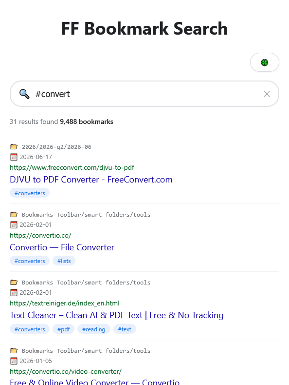
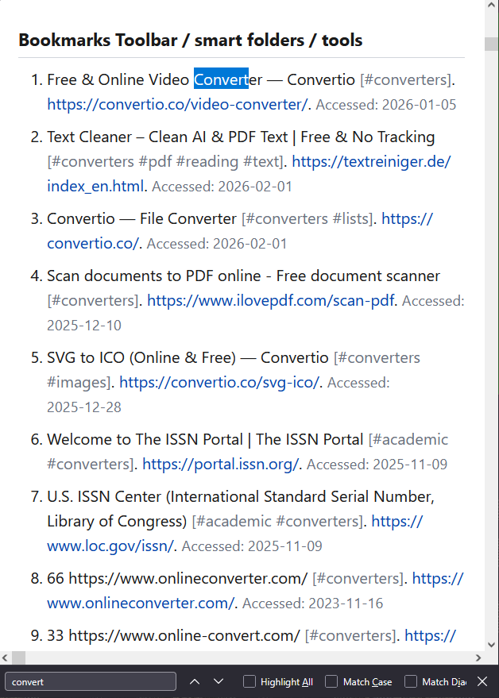
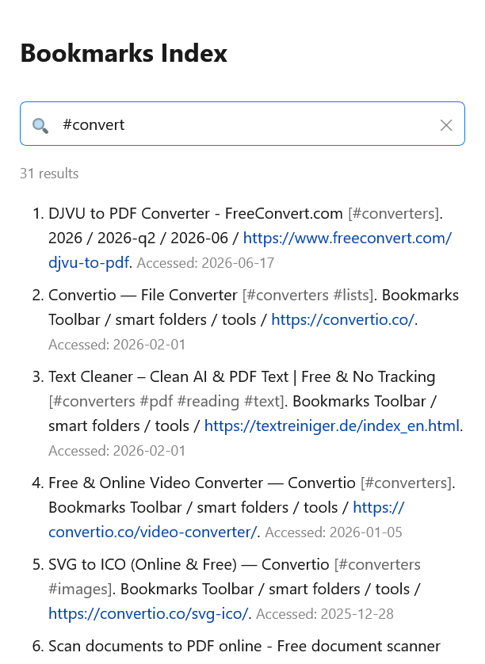

# bookmarks dresser

the imaginary internet and references of your shit or print.

(*) there are bms managers and ctrl B sidebar in FF, which is just enough for search specifically.

## demo

search engine



references





## usage

add bookmarks.html from the firefox export to the root

## search options

search operators

```
name:
folder:
/       OR
""
date:   created
site:
-       NOT
#       tag
```
